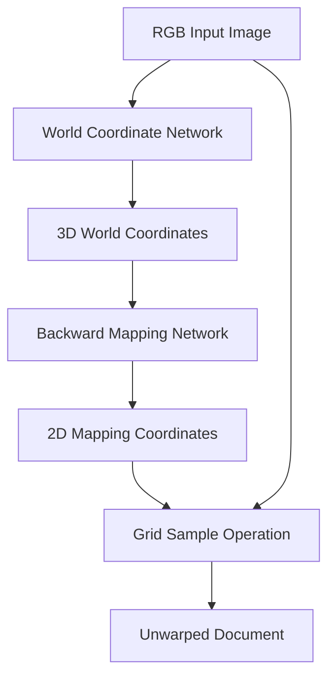

# Design Document

## Overview

The TensorFlow implementation of DewarpNet will replicate the two-stage document unwarping system originally built in PyTorch. The system consists of:

1. **World Coordinate Network (WC)**: A UNet-based model that predicts 3D world coordinates from RGB input images
2. **Backward Mapping Network (BM)**: A DenseNet-based encoder-decoder that predicts 2D backward mapping coordinates for document unwarping

The implementation will maintain identical architecture, training procedures, and data processing pipelines to ensure equivalent performance.

## Architecture

### System Architecture



### Directory Structure

```
tensorflow/
├── models/
│   ├── __init__.py
│   ├── unet_tf.py          # TensorFlow UNet implementation
│   ├── densenet_tf.py      # TensorFlow DenseNet implementation
│   └── model_factory.py    # Model creation utilities
├── loaders/
│   ├── __init__.py
│   ├── doc3d_wc_loader.py  # World coordinate data loader
│   ├── doc3d_bm_loader.py  # Backward mapping data loader
│   └── augmentations.py    # Data augmentation utilities
├── losses/
│   ├── __init__.py
│   ├── grad_loss.py        # Gradient loss implementation
│   ├── recon_loss.py       # Reconstruction loss implementation
│   └── ssim_loss.py        # SSIM loss implementation
├── training/
│   ├── __init__.py
│   ├── train_wc.py         # World coordinate training script
│   ├── train_bm.py         # Backward mapping training script
│   └── utils.py            # Training utilities
├── inference/
│   ├── __init__.py
│   └── infer.py            # Inference pipeline
├── requirements_tf.txt     # TensorFlow dependencies
└── setup_env.py           # Environment setup script
```

## Components and Interfaces

### 1. Model Components

#### UNet Generator (World Coordinate Network)
- **Input**: RGB images (3 channels, 256x256)
- **Output**: World coordinates (3 channels, 256x256)
- **Architecture**: 7-level U-Net with skip connections
- **Key Features**:
  - Encoder-decoder structure with skip connections
  - BatchNorm and LeakyReLU activations
  - Tanh output activation for coordinate regression

#### DenseNet Encoder-Decoder (Backward Mapping Network)
- **Input**: World coordinates (3 channels, 128x128)
- **Output**: Backward mapping coordinates (2 channels, 128x128)
- **Architecture**: Dense blocks with transition layers
- **Key Features**:
  - CoordConv channels for spatial awareness
  - Dense connections within blocks
  - Hardtanh output activation for coordinate bounds

### 2. Data Loading Components

#### World Coordinate Loader
```python
class Doc3DWCLoader:
    def __init__(self, root_path, split='train', img_size=(256, 256), augmentations=True)
    def __getitem__(self, index) -> Tuple[tf.Tensor, tf.Tensor]
    def __len__(self) -> int
```

#### Backward Mapping Loader
```python
class Doc3DBMLoader:
    def __init__(self, root_path, split='train', img_size=(128, 128))
    def __getitem__(self, index) -> Tuple[tf.Tensor, tf.Tensor]
    def __len__(self) -> int
```

### 3. Loss Function Components

#### Gradient Loss
- Implements Sobel edge detection for gradient computation
- Computes L1 loss between predicted and ground truth gradients
- Supports multi-channel inputs with configurable window sizes

#### Reconstruction Loss
- Performs grid sampling to unwarp images using predicted coordinates
- Computes MSE loss between unwarped predictions and ground truth
- Includes SSIM loss component for perceptual quality

### 4. Training Components

#### Training Manager
```python
class TrainingManager:
    def __init__(self, model, optimizer, loss_fn, data_loader)
    def train_epoch(self) -> Dict[str, float]
    def validate_epoch(self) -> Dict[str, float]
    def save_checkpoint(self, path: str)
    def load_checkpoint(self, path: str)
```

## Data Models

### Input Data Format

#### World Coordinate Training Data
- **Images**: RGB PNG files (H×W×3, uint8)
- **Labels**: EXR files containing world coordinates (H×W×3, float32)
- **Normalization**: 
  - Images: [0, 255] → [0, 1]
  - Coordinates: Normalized using dataset-specific min/max values

#### Backward Mapping Training Data
- **Input**: Concatenated albedo and world coordinates (H×W×6, float32)
- **Labels**: MAT files containing 2D mapping coordinates (H×W×2, float32)
- **Preprocessing**: Tight cropping and coordinate normalization

### Model Checkpoints
```python
checkpoint_format = {
    'epoch': int,
    'model_state_dict': dict,
    'optimizer_state_dict': dict,
    'loss': float,
    'metrics': dict
}
```

## Error Handling

### Data Loading Errors
- **Missing Files**: Graceful handling with informative error messages
- **Corrupted Data**: Skip corrupted samples and log warnings
- **Memory Issues**: Implement batch size reduction strategies

### Training Errors
- **GPU Memory**: Automatic batch size adjustment and gradient accumulation
- **Convergence Issues**: Learning rate scheduling and early stopping
- **Checkpoint Corruption**: Backup checkpoint management

### Inference Errors
- **Model Loading**: Validate checkpoint compatibility
- **Input Validation**: Check image dimensions and format
- **Output Generation**: Handle edge cases in grid sampling

## Testing Strategy

### Unit Tests
1. **Model Architecture Tests**
   - Verify output shapes for all model components
   - Test parameter count equivalence with PyTorch
   - Validate forward pass consistency

2. **Data Loading Tests**
   - Test data loader output formats
   - Verify augmentation consistency
   - Check normalization correctness

3. **Loss Function Tests**
   - Compare gradient loss with PyTorch implementation
   - Validate SSIM computation accuracy
   - Test reconstruction loss grid sampling

### Integration Tests
1. **Training Pipeline Tests**
   - End-to-end training loop validation
   - Checkpoint save/load functionality
   - Metric computation accuracy

2. **Inference Pipeline Tests**
   - Model loading and prediction
   - Output format validation
   - Performance benchmarking

### Performance Tests
1. **Training Speed**: Compare training time per epoch with PyTorch
2. **Memory Usage**: Monitor GPU memory consumption
3. **Convergence**: Validate loss curves match PyTorch implementation
4. **Output Quality**: Visual comparison of unwarped documents

### Environment Setup Tests
1. **Conda Environment**: Verify environment creation and activation
2. **GPU Detection**: Test CUDA availability and utilization
3. **Dependency Installation**: Validate all required packages

## Implementation Considerations

### TensorFlow-Specific Adaptations

1. **Eager Execution**: Use tf.function decorators for performance optimization
2. **Data Pipeline**: Leverage tf.data for efficient data loading
3. **Mixed Precision**: Implement automatic mixed precision for faster training
4. **Distributed Training**: Design for multi-GPU scaling capability

### Performance Optimizations

1. **Memory Management**: Implement gradient checkpointing for large models
2. **Data Loading**: Use prefetching and parallel data loading
3. **Model Compilation**: Optimize computational graphs for inference
4. **Batch Processing**: Implement dynamic batching for variable input sizes

### Compatibility Considerations

1. **Checkpoint Conversion**: Utilities to convert between PyTorch and TensorFlow weights
2. **Metric Equivalence**: Ensure identical metric computation across frameworks
3. **Reproducibility**: Implement proper random seed management
4. **Version Compatibility**: Support for TensorFlow 2.x ecosystem