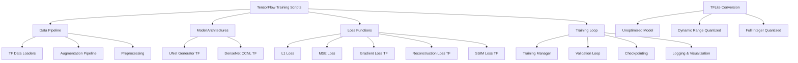

# Design Document

## Overview

This design outlines the implementation of a TensorFlow alternative to the existing PyTorch DewarpNet training pipeline. The system will replicate the exact functionality of `trainwc.py` and `trainbm.py` while maintaining identical model architectures, loss functions, data processing, and training behavior. The implementation will support both world coordinate regression and backward mapping training modes, with the ability to train on subsets and convert to TensorFlow Lite models.

## Architecture

### High-Level Architecture



### Data Organization Structure

The system will expect the following directory structure for the doc3d dataset:

```
data/
├── doc3d/
│   ├── train.txt                 # Training sample identifiers
│   ├── val.txt                   # Validation sample identifiers
│   ├── img/                      # RGB input images
│   │   └── [folder]/[sample].png
│   ├── wc/                       # World coordinate ground truth
│   │   └── [folder]/[sample].exr
│   ├── bm/                       # Backward mapping ground truth
│   │   └── [folder]/[sample].mat
│   └── recon/                    # Reconstructed textures for BM training
│       └── [folder]/chess48/[sample]chess480001.png
├── augtexnames.txt              # Texture files for augmentation
└── textures/                    # Background textures for augmentation
    └── [texture_files]
```

## Components and Interfaces

### 1. Data Pipeline Components

#### TensorFlow Data Loaders
- **Doc3DWCDataset**: TensorFlow equivalent of `doc3dwcLoader`
  - Loads RGB images and world coordinate labels
  - Applies tight cropping and augmentation
  - Normalizes world coordinates using identical parameters
  - Supports subset training (100 samples)

- **Doc3DBMDataset**: TensorFlow equivalent of `doc3dbmnoimgcLoader`
  - Loads albedo, world coordinates, and backward mapping labels
  - Applies tight cropping with random offsets
  - Normalizes backward mapping coordinates
  - Concatenates albedo and world coordinates as input

#### Data Augmentation Pipeline
- **Background texture blending** for world coordinate training
- **Random cropping** with padding for backward mapping training
- **Identical normalization parameters** as PyTorch implementation

### 2. Model Architecture Components

#### UNet Generator (TensorFlow)
```python
class UNetGeneratorTF(tf.keras.Model):
    def __init__(self, input_nc=3, output_nc=3, num_downs=7, ngf=64):
        # Replicate exact PyTorch UNet architecture
        # Skip connections, batch normalization, activation functions
```

#### DenseNet CCNL (TensorFlow)
```python
class DenseNetCCNLTF(tf.keras.Model):
    def __init__(self, img_size=128, in_channels=3, out_channels=2, filters=32):
        # Replicate exact PyTorch DenseNet with coordinate convolution
        # Dense blocks, transition blocks, encoder-decoder structure
```

### 3. Loss Function Components

#### Custom Loss Functions
- **GradientLoss**: TensorFlow implementation of Sobel gradient loss
- **ReconstructionLoss**: Unwarping loss with SSIM computation
- **Combined Loss**: Weighted combination matching PyTorch implementation

### 4. Training Components

#### Training Manager
- **Optimizer**: Adam with identical parameters (lr=1e-5, weight_decay=5e-4)
- **Scheduler**: ReduceLROnPlateau equivalent using tf.keras.callbacks
- **Checkpointing**: Best model and periodic saves
- **Logging**: Console, file, and TensorBoard logging

## Data Models

### Input Data Formats

#### World Coordinate Training
```python
# Input: RGB image (H, W, 3)
# Label: World coordinates (H, W, 3) - normalized to [0, 1]
# Normalization parameters:
xmx, xmn = 1.2539363, -1.2442188
ymx, ymn = 1.2396319, -1.2289206  
zmx, zmn = 0.6436657, -0.67492497
```

#### Backward Mapping Training
```python
# Input: Concatenated albedo + world coordinates (H, W, 6)
# Label: Backward mapping coordinates (H, W, 2) - normalized to [-1, 1]
# Normalization: bm = (bm / [448.0-l-r, 448.0-t-b] - 0.5) * 2
```

### Model Output Formats

#### World Coordinate Model
- Output shape: (batch_size, height, width, 3)
- Activation: Hardtanh(0, 1.0)
- Represents normalized 3D world coordinates

#### Backward Mapping Model  
- Output shape: (batch_size, height, width, 2)
- Activation: Hardtanh(-1, 1)
- Represents normalized 2D backward mapping coordinates

## Error Handling

### Data Loading Errors
- **Missing files**: Graceful handling with informative error messages
- **Corrupted data**: Skip corrupted samples and log warnings
- **Format validation**: Verify image and label formats before processing

### Training Errors
- **Memory management**: Implement gradient checkpointing for large models
- **NaN detection**: Monitor for NaN values in loss and gradients
- **Checkpoint corruption**: Validate checkpoint integrity before loading

### Model Conversion Errors
- **TFLite compatibility**: Validate model operations are TFLite compatible
- **Quantization errors**: Handle quantization failures gracefully
- **Model validation**: Compare outputs between TF and TFLite models

## Testing Strategy

### Unit Testing
- **Data loader validation**: Compare outputs with PyTorch loaders
- **Model architecture verification**: Layer-by-layer comparison
- **Loss function accuracy**: Numerical comparison with PyTorch losses

### Integration Testing
- **End-to-end training**: Train on small dataset and compare metrics
- **Checkpoint compatibility**: Verify save/load functionality
- **TensorBoard logging**: Validate visualization outputs

### Performance Testing
- **Training speed**: Compare training time with PyTorch implementation
- **Memory usage**: Monitor GPU memory consumption
- **TFLite inference**: Benchmark inference speed for each optimization level

### Validation Testing
- **Subset training**: Validate 100-sample training produces expected results
- **Full dataset training**: Compare final model performance with PyTorch
- **Model conversion**: Verify TFLite models maintain accuracy

## TensorFlow Lite Conversion Strategy

### Conversion Pipeline
1. **Model Preparation**: Ensure model uses TFLite-compatible operations
2. **Representative Dataset**: Create calibration dataset for quantization
3. **Three-tier Conversion**:
   - **Tier 1**: No optimization (float32)
   - **Tier 2**: Dynamic range quantization (float16)
   - **Tier 3**: Full integer quantization (int8)

### Optimization Levels

#### Unoptimized Model
```python
converter = tf.lite.TFLiteConverter.from_saved_model(model_path)
# No optimizations applied
tflite_model = converter.convert()
```

#### Dynamic Range Quantization
```python
converter = tf.lite.TFLiteConverter.from_saved_model(model_path)
converter.optimizations = [tf.lite.Optimize.DEFAULT]
tflite_model = converter.convert()
```

#### Full Integer Quantization
```python
converter = tf.lite.TFLiteConverter.from_saved_model(model_path)
converter.optimizations = [tf.lite.Optimize.DEFAULT]
converter.representative_dataset = representative_data_gen
converter.target_spec.supported_ops = [tf.lite.OpsSet.TFLITE_BUILTINS_INT8]
tflite_model = converter.convert()
```

## Implementation Considerations

### Framework Differences
- **Tensor operations**: Map PyTorch operations to TensorFlow equivalents
- **Model definition**: Convert PyTorch nn.Module to tf.keras.Model
- **Training loop**: Adapt PyTorch training loop to TensorFlow's GradientTape
- **Data loading**: Replace PyTorch DataLoader with tf.data.Dataset

### Performance Optimizations
- **Mixed precision training**: Use tf.keras.mixed_precision for faster training
- **Data pipeline optimization**: Implement prefetching and parallel processing
- **Model compilation**: Use XLA compilation for improved performance

### Compatibility Considerations
- **Checkpoint format**: Design checkpoint format for easy conversion between frameworks
- **Inference compatibility**: Ensure TensorFlow models can be used with existing inference code
- **Metric consistency**: Maintain identical evaluation metrics and logging format